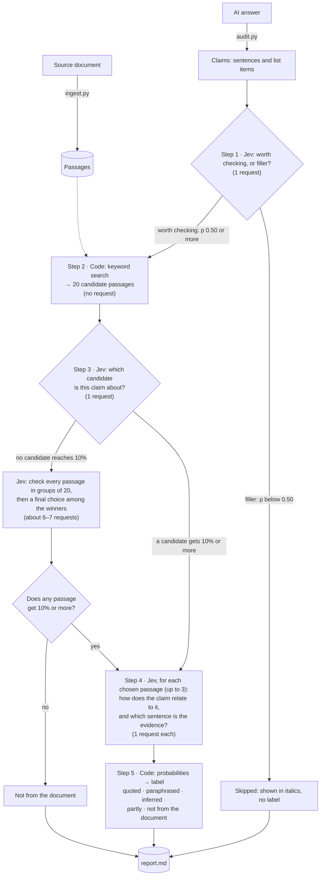

# How auditlm works, step by step

This walks through what happens when auditlm checks an AI answer against its source
document, with examples. It shows the exact requests sent to Jev and the answers Jev sent
back. All the examples are real: they come from the test answer
`tests/fixtures/mh-1-answer.md`, checked against the abridged encyclical *Magnifica
Humanitas*, plus one claim from `tcc-1-answer.md`, checked against *The Tragedy of the
Cognitive Commons*.

For what is being built and why, see [PRD.md](PRD.md). For the label definitions, see
[labels.md](../skills/audit/reference/labels.md).

---

## The whole process at a glance



Step 1 doesn't look at the document: its request contains no passages. It only decides
whether a sentence is worth checking. Whether the sentence is supported by the document is
decided in steps 3–5. (In the current code, steps 2 and 3 start at the same time as step 1, to
save time. For a filler line their results are thrown away; see Example 5.)

Code does everything exact: splitting text, keyword search, counting shared words,
thresholds, and writing the report. Jev answers only narrow questions, and it answers with
probabilities instead of text. A typical claim takes 3 requests. The encyclical answer below
has 16 claims and took 58 requests, 132,000 input tokens and **$0.0055**.

---

## Preparing the inputs (code only)

### The document becomes passages

`ingest.py` splits the source document into passages. A Word document keeps its own
structure: one passage per paragraph, its heading path as the section, and the document's
own paragraph number as the locator. The encyclical numbers its paragraphs, so one passage
from `passages.json` looks like this:

```json
{
  "id": "P028",
  "locator": "¶99",
  "section": "CHAPTER THREE: TECHNOLOGY AND DOMINANCE. THE GRANDEUR OF HUMANITY IN LIGHT OF THE PROMISES OF AI › Artificial intelligence",
  "text": "Even when these tools are described as capable of “learning,” their way of doing so is different from that of a human person. It is not the experience of those who allow themselves to be shaped by life and grow over time through choices, mistakes, forgiveness and fidelity. Rather, it is a form of statistical adaptation based on data and feedback, which can be very effective, but does not imply inner growth."
}
```

A PDF has no reliable paragraph structure, so it becomes passages of about 90–180 words
with a page number as the locator, such as `"p. 17–18"`.

### The answer becomes claims

`audit.py` splits the answer into claims: sentences and list items. Headings aren't
claims; they become context. Each claim keeps its section heading, its list lead-in (if it
is a list item), and the sentence before it. Jev needs these to understand words like
"they" or "this". The answer's third bullet becomes this claim:

```json
{
  "id": "S06",
  "text": "What AI calls learning is statistical adaptation from data and feedback, not inner growth.",
  "context": {
    "section": "What AI is and isn't",
    "previous_sentence": "They have no body, no experiences and no moral conscience."
  }
}
```

---

## How a request to Jev is built

Every request goes to `POST https://api.typesafe.ai/v1/systemone` and has three parts:

- **`state`**: the facts Jev may use: the document title, the claim, its context, and a
  passage when one is being judged.
- **`model`**: which Jev to use. auditlm sends `jev-latest`, and the response names the
  actual version (`jev-1.13.0`).
- **`questions`**: one or more named questions. Each has a `type`, the `instructions`, and,
  for a Choice, the options (`criteria`). Backticked names in the instructions, such as
  `` `sentence` ``, point to fields in the state.

auditlm uses two kinds of question:

| Type | Asks | Answer |
|---|---|---|
| **Noul** | a yes/no question | `noul`: the probability of yes, 0 to 1 |
| **Choice** | pick one of several named options | `choice` (the top option), `probabilities` for every option, and `confidence` |

### A complete request, exactly as sent

This is the request from step 4 of Example 1 below, in full, as captured from the HTTP
body auditlm sent. It asks **three questions about the same state in one request**:
`relation` (a Choice), `specific` (a Noul) and `evidence` (a Choice between the passage's
own sentences).

```json
{
  "state": {
    "document": "Magnifica Humanitas: Encyclical Letter of Pope Leo XIV on Safeguarding the Human Person in the Time of Artificial Intelligence (abridged)",
    "sentence": "What AI calls learning is statistical adaptation from data and feedback, not inner growth.",
    "context": {
      "section": "What AI is and isn't",
      "previous_sentence": "They have no body, no experiences and no moral conscience."
    },
    "passage": "Even when these tools are described as capable of “learning,” their way of doing so is different from that of a human person. It is not the experience of those who allow themselves to be shaped by life and grow over time through choices, mistakes, forgiveness and fidelity. Rather, it is a form of statistical adaptation based on data and feedback, which can be very effective, but does not imply inner growth.",
    "passage_section": "CHAPTER THREE: TECHNOLOGY AND DOMINANCE. THE GRANDEUR OF HUMANITY IN LIGHT OF THE PROMISES OF AI › Artificial intelligence"
  },
  "model": "jev-latest",
  "questions": {
    "relation": {
      "type": "choice",
      "instructions": "An AI assistant wrote `sentence` in an answer about the document `document`. How does `passage`, an excerpt from that document (from the section `passage_section`, when given), bear on `sentence`? `context`, when present, gives the answer's section heading, list lead-in, and previous sentence only to resolve what `sentence` refers to; judge `sentence` itself. A list item continues its `context.list_lead_in`: the item 'monitoring' under the lead-in 'Ostrom's design principles:' claims that monitoring is one of Ostrom's design principles.",
      "criteria": {
        "restates": "The sentence says what the passage says, in the same or other words, or condenses it into a shorter or more general statement, without adding claims or changing details.",
        "infers_from": "The passage doesn't state the sentence's point, but the sentence is a fair conclusion drawn from what it says.",
        "partly": "Part of the sentence comes from the passage and another part does not: it adds a claim the passage doesn't make, or alters a detail such as a number, a name, who said what, or the direction of an effect.",
        "unrelated": "The passage does not address the sentence's point."
      }
    },
    "specific": {
      "type": "noul",
      "instructions": "An AI assistant wrote `sentence` in an answer about the document `document`. Does `sentence` contain at least one specific fact, detail, example, or statement that appears in `passage`, beyond sharing its topic or general terms? `context`, when present, gives the answer's section heading, list lead-in, and previous sentence only to resolve what `sentence` refers to; judge `sentence` itself. A list item continues its `context.list_lead_in`: the item 'monitoring' under the lead-in 'Ostrom's design principles:' claims that monitoring is one of Ostrom's design principles."
    },
    "evidence": {
      "type": "choice",
      "instructions": "An AI assistant wrote `sentence` in an answer about the document `document`. Which sentence of `passage` does `sentence` rely on most directly? `context`, when present, gives the answer's section heading, list lead-in, and previous sentence only to resolve what `sentence` refers to; judge `sentence` itself. A list item continues its `context.list_lead_in`: the item 'monitoring' under the lead-in 'Ostrom's design principles:' claims that monitoring is one of Ostrom's design principles.",
      "criteria": {
        "E1": "Even when these tools are described as capable of “learning,” their way of doing so is different from that of a human person.",
        "E2": "It is not the experience of those who allow themselves to be shaped by life and grow over time through choices, mistakes, forgiveness and fidelity.",
        "E3": "Rather, it is a form of statistical adaptation based on data and feedback, which can be very effective, but does not imply inner growth."
      }
    }
  }
}
```

### The complete response, as received

```json
{
  "model": "jev-1.13.0",
  "answers": {
    "relation": {
      "type": "choice",
      "choice": "restates",
      "confidence": 0.98,
      "probabilities": {
        "restates": 0.99,
        "unrelated": 0.0,
        "infers_from": 0.0,
        "partly": 0.01
      }
    },
    "specific": {
      "type": "noul",
      "noul": 0.96
    },
    "evidence": {
      "type": "choice",
      "choice": "E3",
      "confidence": 1.0,
      "probabilities": {
        "E3": 1.0,
        "E1": 0.0,
        "E2": 0.0
      }
    }
  },
  "usage": {
    "input_tokens": 1177,
    "output_tokens": 109
  }
}
```

What to notice:

- All three questions shared one `state`, and Jev answered them independently. None of the
  answers could see the others.
- Each answer comes back under the name its question was sent with (`relation`, `specific`,
  `evidence`).
- A Choice answer has probabilities for every option. A Noul answer is a single number.
- `usage` counts the tokens. Only input tokens are billed, at $0.042 per million, so this
  request cost about $0.00005.

auditlm caches every answer by the exact request, so re-running an unchanged audit costs
nothing. Caching also keeps results stable: sending the same request again can give slightly
different numbers. A repeat of this request gave `restates` 1.00 and `specific` 0.97
instead of 0.99 and 0.96.

---

## Example 1: a paraphrased claim, step by step

**Claim S06:** *"What AI calls learning is statistical adaptation from data and feedback, not
inner growth."*

### Step 1: Is this sentence worth checking, or is it filler? (1 request)

This request contains no passages, only the sentence, its context, and the document's title.

**Request, exactly as sent**

```json
{
  "state": {
    "document": "Magnifica Humanitas: Encyclical Letter of Pope Leo XIV on Safeguarding the Human Person in the Time of Artificial Intelligence (abridged)",
    "sentence": "What AI calls learning is statistical adaptation from data and feedback, not inner growth.",
    "context": {
      "section": "What AI is and isn't",
      "previous_sentence": "They have no body, no experiences and no moral conscience."
    }
  },
  "model": "jev-latest",
  "questions": {
    "claim": {
      "type": "noul",
      "instructions": "Does `sentence`, from an AI assistant's answer about the document `document`, make a claim about the document or its subject, rather than being a greeting, a transition, an offer of further help, or a remark about the answer itself? `context`, when present, gives the answer's section heading, list lead-in, and previous sentence only to resolve what `sentence` refers to; judge `sentence` itself. A list item continues its `context.list_lead_in`: the item 'monitoring' under the lead-in 'Ostrom's design principles:' claims that monitoring is one of Ostrom's design principles."
    }
  }
}
```

**Response, as received**

```json
{
  "model": "jev-1.13.0",
  "answers": {
    "claim": {
      "type": "noul",
      "noul": 0.97
    }
  },
  "usage": {
    "input_tokens": 495,
    "output_tokens": 20
  }
}
```

0.97 is well above the 0.50 cutoff, so the sentence is worth checking and goes on to step 2.

### Step 2: Shortlist candidate passages (code, no request)

Keyword search (BM25, with light stemming, over each passage's text and section heading)
ranks all 96 passages against the claim and keeps the top 20:

```
P028, P036, P079, P092, P055, P045, P076, P047, P037, P034,
P044, P025, P046, P027, P061, P040, P029, P015, P038, P068
```

If the claim contains a quotation, any passage containing that quotation word for word is
always added to the shortlist.

### Step 3: Which passage is this claim about? (1 request)

All 20 candidates go into **one** Choice. Jev compares them against each other instead of
rating each on its own. "None of these" is an option too.

**Request (shortened: 18 of the 20 candidate passages are left out)**

```json
{
  "state": {
    "document": "Magnifica Humanitas: Encyclical Letter of Pope Leo XIV on Safeguarding the Human Person in the Time of Artificial Intelligence (abridged)",
    "sentence": "What AI calls learning is statistical adaptation from data and feedback, not inner growth.",
    "context": {
      "section": "What AI is and isn't",
      "previous_sentence": "They have no body, no experiences and no moral conscience."
    }
  },
  "model": "jev-latest",
  "questions": {
    "addresses": {
      "type": "choice",
      "instructions": "An AI assistant wrote `sentence` in an answer about the document `document`. Which passage from the document addresses the specific point `sentence` makes (its claim, names, numbers, examples, or attributions), whether the passage agrees with it or not? <shortened: context note>",
      "criteria": {
        "P028": "[CHAPTER THREE: TECHNOLOGY AND DOMINANCE. THE GRANDEUR OF HUMANITY IN LIGHT OF THE PROMISES OF AI › Artificial intelligence] Even when these tools are described as capable of “learning,” their way of doing so is different from that of a human person. It is not the experience of those who allow themselves to be shaped by life and grow over time through choices, mistakes, forgiveness and fidelity. Rather, it is a form of statistical adaptation based on data and feedback, which can be very effective, but does not imply inner growth.",
        "P036": "[CHAPTER THREE: TECHNOLOGY AND DOMINANCE. THE GRANDEUR OF HUMANITY IN LIGHT OF THE PROMISES OF AI › Artificial intellige <shortened>",
        "<shortened>": "the other 18 candidate passages, each with its section and full text",
        "none": "None of these passages discusses what the sentence is about; at most they share its general topic. A passage that gives different facts about the same thing (other numbers, names, or conclusions) does address it."
      }
    }
  }
}
```

**Response (in full)**

```json
{
  "model": "jev-1.13.0",
  "answers": {
    "addresses": {
      "type": "choice",
      "choice": "P028",
      "confidence": 1.0,
      "probabilities": {
        "P034": 0.0,
        "P047": 0.0,
        "P079": 0.0,
        "P044": 0.0,
        "P068": 0.0,
        "P061": 0.0,
        "P037": 0.0,
        "none": 0.0,
        "P076": 0.0,
        "P038": 0.0,
        "P029": 0.0,
        "P028": 1.0,
        "P055": 0.0,
        "P046": 0.0,
        "P015": 0.0,
        "P025": 0.0,
        "P027": 0.0,
        "P045": 0.0,
        "P092": 0.0,
        "P040": 0.0,
        "P036": 0.0
      }
    }
  },
  "usage": {
    "input_tokens": 4763,
    "output_tokens": 227
  }
}
```

At 4,763 input tokens, this is the most expensive request type, because every candidate's
full text is sent. The rule in code: every passage with at least 10% of the probability goes
to step 4, up to 3 passages. Here only P028 (¶99) qualifies.

### Step 4: How does the claim relate to the chosen passage? (1 request)

This is the request and response shown in full under [How a request to Jev is built](#how-a-request-to-jev-is-built).
The state now includes the passage, and three questions go in one request:

- `relation` (Choice): restates, infers from, partly, or unrelated → **restates, 0.99**;
- `specific` (Noul): does the claim take a specific fact from the passage? → **0.96**;
- `evidence` (Choice): which of the passage's three sentences is the evidence? → **E3, 1.00**.

### Step 5: Turn the probabilities into a label (code)

`audit.py` checks these rules in order for each chosen passage, and the first rule that
applies sets the label. The table uses this example's claim, S06 ("What AI calls learning is
statistical adaptation from data and feedback, not inner growth"), and its one chosen
passage, ¶99:

- **This claim** is S06's value for what the rule checks: a word count done by code, or
  Jev's probabilities from step 4.
- **Result** is whether the rule applies to S06.

| Rule | This claim | Result |
|---|---|---|
| 8+ consecutive words shared with the passage, or a quotation found in it word for word → **quoted** | 3 shared words | no |
| p(restates) + p(infers_from) ≥ 0.70 → **paraphrased** (or **inferred**, if infers_from is larger) | 0.99 + 0.00 = 0.99 | **paraphrased** |
| that + p(partly) ≥ 0.60, *and* specific ≥ 0.50 → **partly** | (not needed) | |
| otherwise → **not from the document** | | |

The evidence sentence is E3, copied from the document. Jev picks a sentence; it never writes
one, so the evidence can't be misquoted.

### What the reader sees

These lines are copied from the report, [docs/examples/mh-1-report.md](examples/mh-1-report.md).
In the annotated answer:

> - What AI calls learning is statistical adaptation from data and feedback, not inner growth. `[¶99 · paraphrased]`

Under "Where each part came from":

> **¶99** · CHAPTER THREE: TECHNOLOGY AND DOMINANCE. THE GRANDEUR OF HUMANITY IN LIGHT OF THE PROMISES OF AI › Artificial intelligence
> - *paraphrased*: What AI calls learning is statistical adaptation from data and feedback, not inner growth.
>   > Rather, it is a form of statistical adaptation based on data and feedback, which can be very effective, but does not imply inner growth.

---

## Example 2: a claim that is not from the document

**Claim S11:** *"The European Union's AI Act, which took effect in 2024, is one example of
the kind of legal framework he has in mind."*

The encyclical calls for "robust legal frameworks" but never mentions the EU AI Act, so this
claim comes from outside the document. The requests have the same shape as in Example 1;
only the answers differ.

**Step 3, choose** among 20 candidates. The `answers` part of the response:

```json
{
  "addresses": {
    "type": "choice",
    "choice": "none",
    "confidence": 0.62,
    "probabilities": {
      "none": 0.65,
      "P036": 0.31,
      "P086": 0.03,
      "P063": 0.01,
      "<shortened>": "the other 17 options, all 0.0"
    }
  }
}
```

"None" leads, but P036 (¶106) has 31% of the probability. That's above the 10% cutoff, so
P036 still goes to step 4. This is deliberate. When a passage gives *different* facts about
the same thing, Jev tends to answer "none" here, so the real judgment is left to step 4.

**Step 4, relate** to ¶106. The request has the same shape as the complete request under "How a request to Jev is built", with ¶106 as
the passage. The `answers` part of the response, in full:

```json
{
  "relation": {
    "type": "choice",
    "choice": "partly",
    "confidence": 0.7,
    "probabilities": {
      "unrelated": 0.06,
      "restates": 0.0,
      "infers_from": 0.16,
      "partly": 0.78
    }
  },
  "specific": {
    "type": "noul",
    "noul": 0.1
  },
  "evidence": {
    "type": "choice",
    "choice": "E4",
    "confidence": 1.0,
    "probabilities": {
      "E2": 0.0,
      "E1": 0.0,
      "E5": 0.0,
      "E4": 1.0,
      "E3": 0.0
    }
  }
}
```

**Step 5, label (code).** The same rules as in Example 1, checked in order for claim S11 and
its one chosen passage, ¶106. **This claim** is S11's value for what the rule checks, and
**Result** is whether the rule applies:

| Rule | This claim | Result |
|---|---|---|
| 8+ consecutive words shared with the passage, or a quotation found in it word for word → **quoted** | 1 shared word | no |
| p(restates) + p(infers_from) ≥ 0.70 → **paraphrased** (or **inferred**, if infers_from is larger) | 0.00 + 0.16 = 0.16 | no |
| that + p(partly) ≥ 0.60, *and* specific ≥ 0.50 → **partly** | 0.16 + 0.78 = 0.94, but specific = 0.10 | no |
| otherwise → **not from the document** | | **not from the document** |

The third row is the one that matters. The probabilities alone would make the claim
*partly* from ¶106, but **specific = 0.10**: the claim shares the passage's *topic* ("legal
frameworks"), not any fact from it. Because 0.94 is at least 0.30, ¶106 is still shown to
the reader as the closest passage.

This is why the `specific` question exists. Asked alone, the `partly` option is read
literally: any claim that shares a term with the passage counts as "partly from it". Before
`specific` was added, 4 of the 7 claims not from the document in the tuning answers were
wrongly labelled *partly*.

The reader sees:

> The European Union's AI Act, which took effect in 2024, is one example of the kind of legal framework he has in mind. `[not from the document]`

and, under "Not from the document":

> 3. The European Union's AI Act, which took effect in 2024, is one example of the kind of legal framework he has in mind. *Closest passage: ¶106.*

---

## Example 3: a quoted claim (decided by code)

**Claim S09:** *"He calls for prudence, rigorous evaluation and even, at times, a slower pace
in adopting AI."*

Jev chose ¶106 with probability 1.0, and relate returned restates 0.88. But the label is
settled before those numbers matter. The claim shares **14 consecutive words** with the
passage ("calling for prudence, rigorous evaluation and even, at times, a slower pace in
adopting AI"), and the rule is that 8 or more shared words is **quoted**.

Counting shared words is exact, so it's done in code, not by asking Jev.

> He calls for prudence, rigorous evaluation and even, at times, a slower pace in adopting AI. `[¶106 · quoted]`

---

## Example 4: nothing matches, so every passage is checked

**Claim (tcc-1, S09):** *"Similar worries were raised about calculators in math classrooms in
the 1970s."*

The paper never mentions calculators. The keyword search found only 14 candidates with any
matching words, and Jev rejected them all. The `answers` part of the response:

```json
{
  "addresses": {
    "type": "choice",
    "choice": "none",
    "confidence": 0.97,
    "probabilities": {
      "none": 0.98,
      "P049": 0.02,
      "<shortened>": "the other 13 options, all 0.0"
    }
  }
}
```

No candidate reached 10%, so auditlm doesn't trust the keyword search and checks **every**
passage. It sends 6 Choice requests, one per group of 20 passages (P001–P020, P021–P040,
P041–P060, P061–P080, P081–P100 and P101–P105):

| Group | Answer |
|---|---|
| P001–P020 | none 0.94 · P012 0.05 |
| P021–P040 | none 0.96 · P039 0.03 |
| P041–P060 | none 0.98 · P059 0.01 |
| P061–P080 | none 0.98 · P080 0.01 |
| P081–P100 | none 0.99 · P100 0.01 |
| P101–P105 | none 1.00 |

No passage in any group reached 10%, so the claim is **not from the document**, with no
closest passage.

If one or more groups had produced a passage above 10%, those winners would have competed in
one final Choice, and the result would have gone on to step 4 as usual. This fallback is
what keeps a missed keyword search from turning into a wrong label. It costs about 7 extra
requests, and only for claims the shortlist can't place.

---

## Example 5: filler

**Claim S16:** *"I hope this overview is useful for your class."* The `answers` part of the
response to the step 1 request:

```json
{ "claim": { "type": "noul", "noul": 0.02 } }
```

0.02 is below 0.50, so the line is **skipped**. It appears in the report in italics, with no
label.
